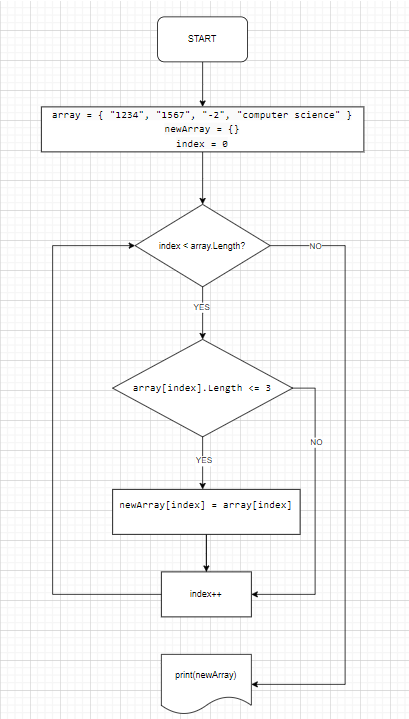

# Итоговая контрольная работа по основному блоку!

### Задача: 
Написать программу, которая из имеющегося массива строк формирует новый массив из строк, длина которых меньше, либо равна 3 символам. Первоначальный массив можно ввести с клавиатуры, либо задать на старте выполнения алгоритма.

Примеры: 

[“Hello”, “2”, “world”, “:-)”] → [“2”, “:-)”] 

[“1234”, “1567”, “-2”, “computer science”] → [“-2”] 

[“Russia”, “Denmark”, “Kazan”] → []

### Блоксхема:

### Описание решения:

1) Зададим массив array из элементов типа string

2) Создадим метод CreateArray, который принимает в качестве аргумента строковый массив.

3) В методе следующий алгоритм:

    Создадим новый массив newArray.

    В ходе перебора элементов принятого массива, 
    с помощью цикла for 
    проверяем: 
    
    если элемент состоит из 3х и менее символов, 
    записываем элемент в новый массив.  
    Метод возвращает новый массив.

4)  Вне метода выводим новый массив в консоль с помощью  
string.Join
